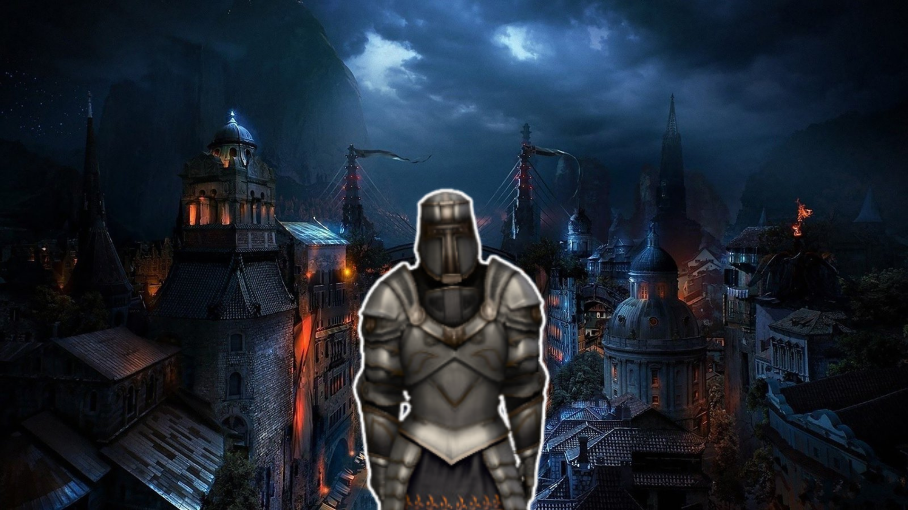

# Apolo Legacy

**Apolo Legacy** es un emocionante juego de mazmorras en estilo dungeon crawler con un enfoque en combate intenso y exploración. Creado con Unity Engine y Spatial, este juego lleva a los jugadores a través de mazmorras llenas de peligros y tesoros. Prepárate para enfrentarte a monstruos temibles y descubrir poderosas armas en tu búsqueda para preservar el legado de Apolo.

## Características Principales

- **Combate Dinámico**: Enfréntate a una variedad de criaturas enemigas en batallas que requieren tanto estrategia como reflejos rápidos.
- **Exploración de Mazmorras**: Cada mazmorra es única, con su propia configuración de enemigos, tesoros y secretos que descubrir.
- **Progresión del Personaje**: Mejora tus habilidades y equipo a medida que profundizas en las mazmorras más desafiantes.
- **Estilo Artístico Inspirado en la Mitología**: Un hermoso diseño visual que combina elementos clásicos y modernos.

## Tecnologías Utilizadas

- **Unity Engine 2022.3.26f1 LTS**
- **Adobe Photoshop**
- **Canva**

## Assets
- [RPG Unit Frames](https://assetstore.unity.com/packages/2d/gui/icons/rpg-unitframes-1-powerful-metal-95252#description)
- [Basic RPG Cursors](https://assetstore.unity.com/packages/2d/textures-materials/basic-rpg-cursors-139404)
- [Stylized Fantasy Armory](https://assetstore.unity.com/packages/3d/environments/fantasy/stylized-fantasy-armory-low-poly-3d-art-249203)
- [Warrior 3](https://assetstore.unity.com/packages/3d/characters/humanoids/fantasy/warrior-3-180877)
- [Medieval Weapons](https://assetstore.unity.com/packages/3d/props/weapons/free-pack-of-medieval-weapons-136607)
(Ampliaremos)

##Sketchs

## Contacto
- Discord: jinmori31
